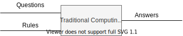
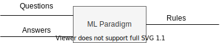
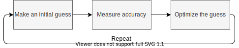
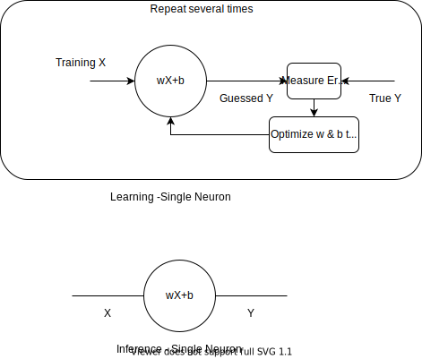
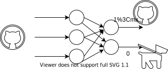
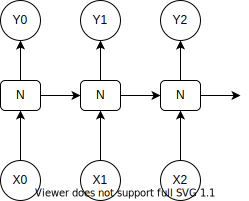
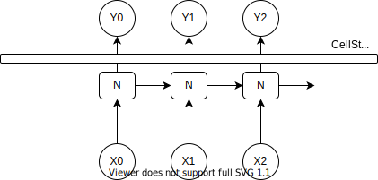

# Summary 
Here I am going to summarize what I have learnt so far.

- [Summary](#summary)
  - [Machine learning paradigm](#machine-learning-paradigm)
    - [Dense neural networks (DNN)](#dense-neural-networks-dnn)
    - [Recurrent layers (RNN)](#recurrent-layers-rnn)
    - [Convolutional layers (CNN)](#convolutional-layers-cnn)

## Machine learning paradigm
In traditional programming paradigm, a coder writes rules and when an input is applied to those rules, answers can be derived. 

Machine learning paradigm is different. In ML, the computing platform learns the rules itself by looking at the questions and their correct answers. 

The ML process basically involve three fundamental steps:

- Make an initial guess
- Measure accuracy
- Optimize your guess
  
Repeating these steps over and over to optimize the guess, i.e., a repeated effort to lower the error in the guess would naturally increase accuracy. 

We used an example to demonstrate these concepts where we had X and Y array values. We wrote code from scratch [MinimizingLoss][Notebooks/MinimizingLoss.ipynb] that used the ML process shown above which made it to learn a linear relationship between X and Y, i.e., 

$$
Y = wX + b
$$

By adjusting w and b, the model could decrease error in it's accuracy for every iteration. This was the mathematical basis for a neuron. Neuron could store values of w and b and using the ML process shown above it could figure out the value of Y for a given X. 

When we use several of these signle neurons in layers, very  interesting things happen. We saw that these neurons when used together in conjunction, helped to figure out more complex relationships. For example, we saw classification technique .

### Dense neural networks (DNN)

When basic neurons are stacked together as shown above, we call them Dense neural networks (DNN). Each layer is called as a Dense layer because each neuron in a layer is connected to every neuron in the previous layer. Classification diagram above just shows two layers with 3 neurons in the first layer and 2 neurons in the second layer. But in reality there could be many layers and the number of neurons in layers can be quite large. These dense layers are sometimes called as hidden layers. Is that a reference to Hidden Markov Models ?

### Recurrent layers (RNN)
We did not touch on this topic yet. Basically in recurrent neural networks, a neuron learns wights and passes those to the next neuron in the same layer. 

Say we have a sequence of values [X0, X1, X2] and we wish to learn a corresponding sequence of [Y0, Y1, Y2] then we would want to preserve the sequential relationship b/w Xs and Ys. To do this, each Neuron (N) passes on it's learned values to the next N in the same layer. For example the input for the 2nd neuron in the diagram is the outut from first neuron and X1. Considering both of these inputs the neuron learns and infers Y1. 

There are many variations of RNN. One of the most powerful is called as Long short term memory (LSTM). Unlike normal RNN where X0 can impact Y1 and X1 can impact Y2, in LSTM variant X0 can impact say Y92. This is done by maintaining a special data structure *Cell State* which preserves the context across multiple neurons.

### Convolutional layers (CNN)
Yet another type of neural network layer that forms building blocks of Convolutional neural networks. This type of network is heavily used in image/video recognition, image segmentation, NLP, medical image analysis, financial time-series etc. 
We are going to study this in more details soon.
